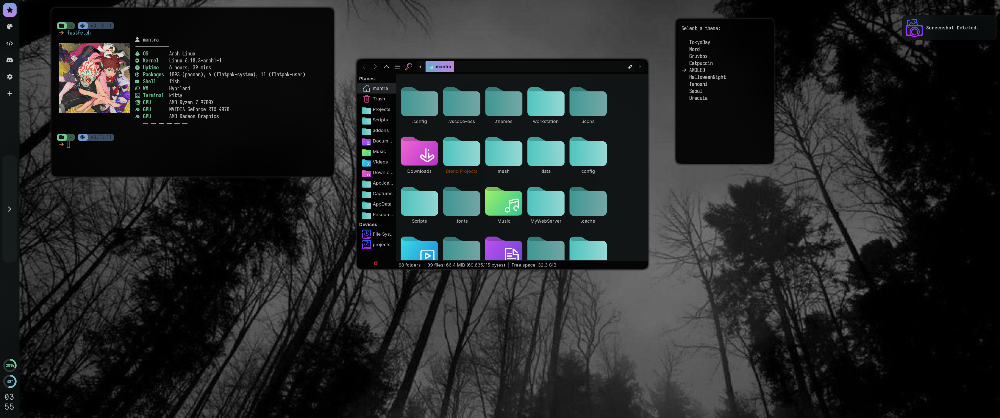

# 🌌 My Dotfiles  

Welcome to my **dotfiles**, powered by [Chezmoi](https://www.chezmoi.io/).  
Designed for **Wayland enthusiasts** with Hyprland, these dotfiles combine productivity, aesthetics, and real-time system monitoring.  

---

## ✨ Features

- **Selectable Themes**  
  Switch easily between light, dark, or custom themes.  

- **Sidebar**  
  Clean and functional sidebar for quick navigation and system overview.  

- **Conky Widgets**  
  Real-time desktop monitoring with widgets for CPU, RAM, network, disk usage, and time.  

- **Wayland-Optimized**  
  Everything is set up for a smooth, modern Wayland workflow.  

---

## 🛠️ Apps & Tools Configured

| App        | Description                                                                 |
|------------|-----------------------------------------------------------------------------|
| **Kitty**  | GPU-accelerated terminal emulator with custom themes and font settings.     |
| **Hyprland** | Dynamic tiling Wayland compositor with custom layouts and shortcuts.      |
| **Waybar** | Highly customizable status bar for Wayland with modules like CPU, RAM, battery, and network. |
| **Conky**  | Lightweight system monitor for CPU, RAM, disk, network, and time.         |
| **Thunar** | Fast, simple, and configurable file manager.                                |
| **Starship** | Minimal, fast, and elegant prompt for your terminal, fully themed.       |
| **Rofi**   | Application launcher, window switcher, and dmenu replacement with themes. |

---

## 🖼️ Screenshots

<div align="center">
  
  
  
</div>

---

## ⚡ Installation

```bash
# Install Chezmoi
sh -c "$(curl -fsLS get.chezmoi.io)"

# Apply my dotfiles
chezmoi init --apply mattthefox/dotfiles
